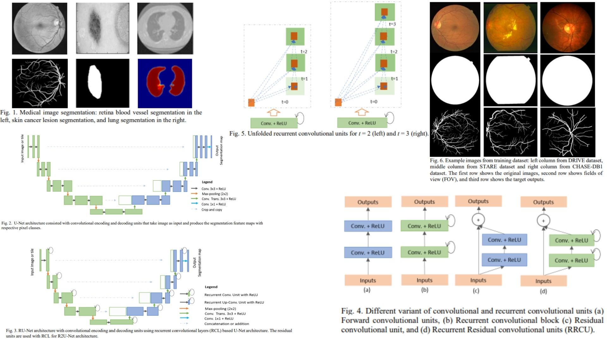

# 🌀 R2U-Net-Replication — Recurrent Residual U-Net for Medical Image Segmentation

This repository provides a **faithful Python replication** of the **R2U-Net framework** for 2D medical image segmentation.  
It implements the pipeline described in the original paper, including **recurrent residual blocks, encoder-decoder connections, and skip concatenations**.

Paper reference: *[R2U-Net: A Recurrent Residual Convolutional Neural Network for Medical Image Segmentation](https://arxiv.org/abs/1802.06955)*  

---

## Overview ✨



> The model extends standard U-Net by introducing **Recurrent Residual Convolutional Layers (RRCNN)** at each stage, enhancing **contextual feature learning** while preserving fine details.

Key points:

* **Encoder** extracts hierarchical features $$E_i$$ through recurrent residual blocks and downsampling  
* **Decoder** upsamples and merges features with skip connections $$E_i$$  
* **Recurrent Residual Convolutions** $$H_i$$ refine features across $$t$$ time-steps:  
  $$H_i^{(0)} = x_i, \quad H_i^{(k)} = ReLU(BN(Conv(H_i^{(k-1)}) + x_i)), \quad k=1,\dots,t$$  
* **Final output** predicts pixel-wise segmentation $$\hat{Y} = f_\theta(X)$$  

---

## Core Math 📐

**Recurrent Residual Convolution (RCL):**

$$H^{(k)} = \text{BN} \Big( \text{ReLU} (Conv(H^{(k-1)}) + x) \Big), \quad k=1\dots t$$

**Residual Connection:**

$$
RRCNN(x) = x + H^{(t)}
$$

**Segmentation loss** (Dice + Cross-Entropy):

$$
\mathcal{L} = \mathcal{L}_{Dice} + \mathcal{L}_{CE}
$$

**Dice coefficient**:

$$
Dice = \frac{2 \sum_i p_i g_i + \epsilon}{\sum_i p_i + \sum_i g_i + \epsilon}
$$

Where $$p_i$$ is the predicted probability, $$g_i$$ the ground truth, and $$\epsilon$$ a smoothing factor.

---

## Why R2U-Net Matters 🌿

* Captures **temporal context** through recurrent convolutions ⏳  
* Preserves **fine-grained details** via residual connections 🧵  
* Delivers **accurate 2D segmentation maps** for medical images 🩺  

---

## Repository Structure 🏗️

```bash
R2UNet-Replication/
├── src/
│   ├── blocks/                          # 🔥 Core building blocks (from paper)
│   │   ├── rcl.py                       # Recurrent Convolution Layer (Eq.1)
│   │   ├── rcnn_block.py                # RCL stack (RU-Net core)
│   │   ├── rrcnn_block.py               # RRCNN = RCL + Residual (Eq.3)
│   │   └── upsample_block.py            # UpConv (decoder)
│   │
│   ├── encoder/
│   │   └── encoder.py                   # Encoder: RRCNN + MaxPool
│   │                                     # E1, E2, E3, Bottleneck
│   │
│   ├── decoder/
│   │   └── decoder.py                   # Decoder: UpConv + Concat + RRCNN
│   │                                     # D3, D2, D1
│   │
│   ├── head/
│   │   └── segmentation_head.py         # 1x1 Conv (output layer)
│   │
│   ├── model/
│   │   └── r2unet.py                    # 🔥 Full R2U-Net pipeline
│   │
│   └── config.py                        # t (time-step), channels, device, etc.
│
├── images/
│   └── figmix.jpg                        # Overview figure reference
│
├── requirements.txt
└── README.md
```

---

## 🔗 Feedback

For questions or feedback, contact:  
[barkin.adiguzel@gmail.com](mailto:barkin.adiguzel@gmail.com)
